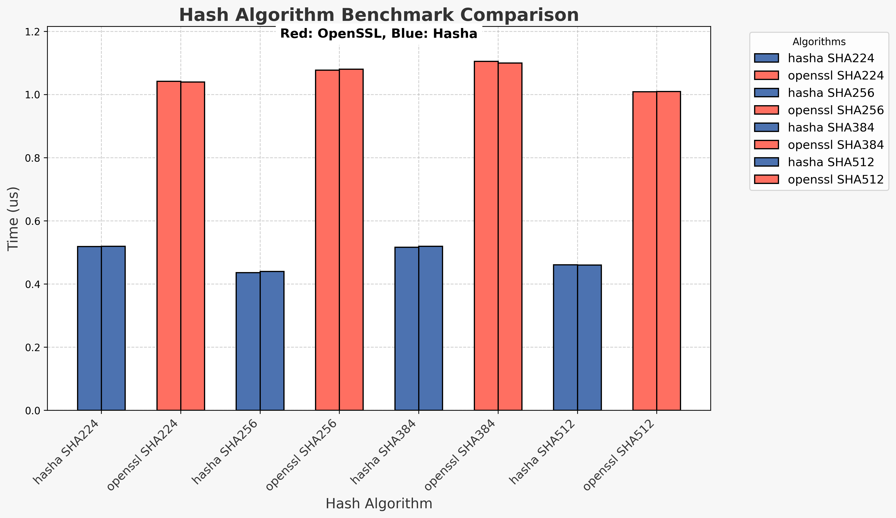

# libhasha

## **libhasha is a standalone lightweight hashing library supporting multiple hashing algorithms written in C**

## 
- **Processor: Intel Core i5 7th generation.** (
in sha2 libhasha is 2 times faster than libopenssl )

### Supported Algorithms

| **Algorithm** | **Variants**                                  |
|---------------|-----------------------------------------------|
| **CRC**       | `crc32`                                       |
| **MD**        | `md5`                                         |
| **SHA1**      |                                               |
| **SHA2**      | `sha224`, `sha256`, `sha384`, `sha512`,       |
|               | `sha512_224`, `sha512_256`                    |
| **SHA3**      | `sha3_224`, `sha3_256`, `sha3_384`, `sha3_512`|
| **Keccak**    | `keccak224`, `keccak256`, `keccak384`,        |
|               | `keccak512`                                   |
| **Blake**     | `blake3`                                      |

## Building
   - ### **Build**
   ```bash
   https://github.com/reslaid32/hasha.git
   cd hasha
   make all
   ```

   - ### **Testing**
   ```bash
   https://github.com/reslaid32/hasha.git
   cd hasha
   sudo make all install check
   ```

## Installing & Uninstalling
   - ### **Installing**
   ```bash
   git clone https://github.com/reslaid32/hasha.git
   cd hasha
   sudo make all install
   ```

   - ### **Removing a library**
   ```bash
   git clone https://github.com/reslaid32/hasha.git
   cd hasha
   sudo make uninstall
   ```
