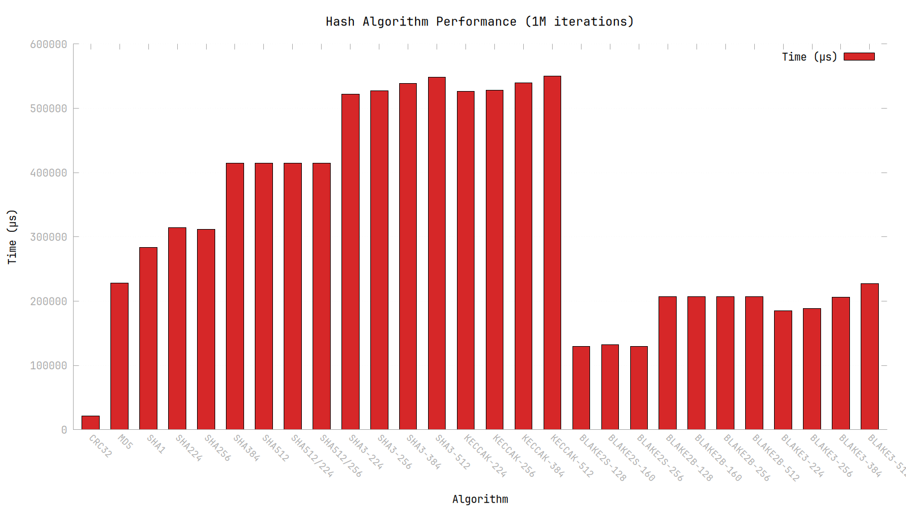
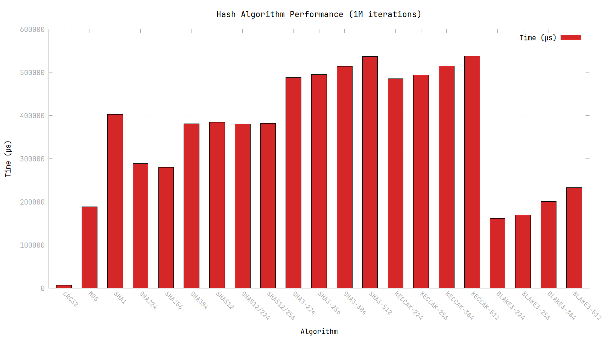
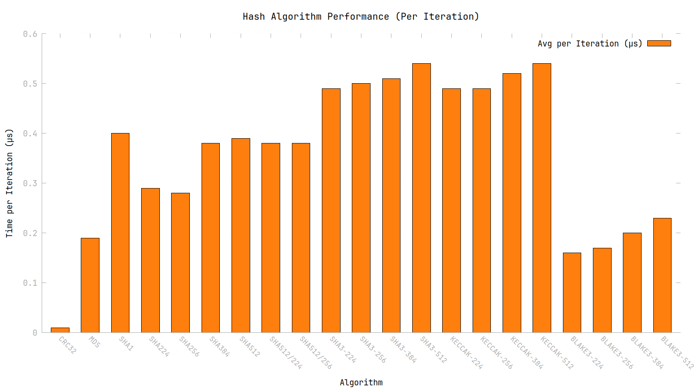

# libhasha

## **libhasha is a standalone lightweight hashing library supporting multiple hashing algorithms written in C**

### **The project is written just for the sake of practicing, no more**

<!---
# Benchmark
   <div style="display: flex; gap: 10px;">
      
   </div>

# Benchmarks (2.0.0)
 - All
   <div style="display: flex; gap: 10px;">
      
      
   </div>

# Benchmarks (1.0.5)

 - SHA-2
   <div style="display: flex; gap: 10px;">
      
      
   </div>

 - SHA-3
   <div style="display: flex; gap: 10px;">
      
      
   </div>
-->

### Supported Algorithms

| **Algorithm** | **Variants**                                  |
|---------------|-----------------------------------------------|
| **CRC**       | `crc32`                                       |
| **MD**        | `md5`                                         |
| **SHA1**      | `sha1`                                        |
| **SHA2**      | `sha224`, `sha256`, `sha384`, `sha512`,       |
|               | `sha512_224`, `sha512_256`                    |
| **SHA3**      | `sha3_224`, `sha3_256`, `sha3_384`, `sha3_512`|
| **Keccak**    | `keccak224`, `keccak256`, `keccak384`,        |
|               | `keccak512`                                   |
| **Blake**     | `blake2s`, `blake2b`, `blake3`                |

# Building
   - ### **Build**
   ```bash
   https://github.com/reslaid32/hasha.git
   cd hasha
   make all
   ```

   - ### **Testing**
   ```bash
   https://github.com/reslaid32/hasha.git
   cd hasha
   sudo make all install check
   ```

## Installing & Uninstalling
   - ### **Installing**
   ```bash
   git clone https://github.com/reslaid32/hasha.git
   cd hasha
   sudo make all install
   ```

   - ### **Removing a library**
   ```bash
   git clone https://github.com/reslaid32/hasha.git
   cd hasha
   sudo make uninstall
   ```

### **Using CMake**
   - ### **Installing**
   ```bash
   git clone https://github.com/reslaid32/hasha.git
   cd hasha
   mkdir build && cd build
   cmake ..; cmake --build .; sudo cmake --install . --prefix /usr/
   ```